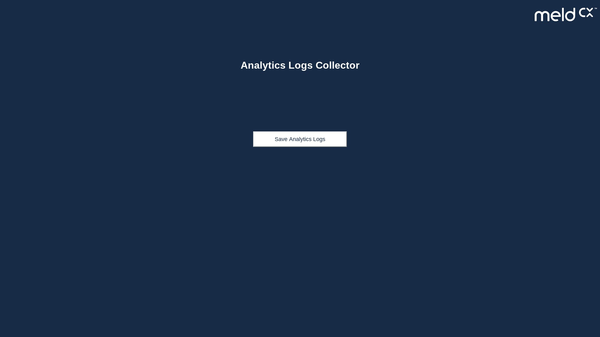
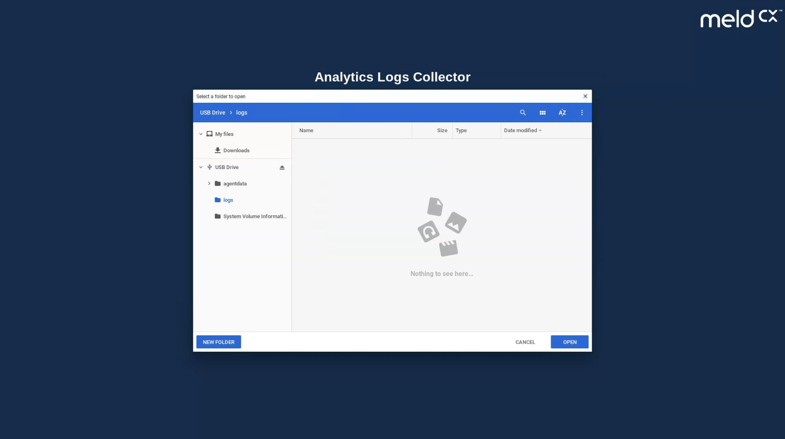
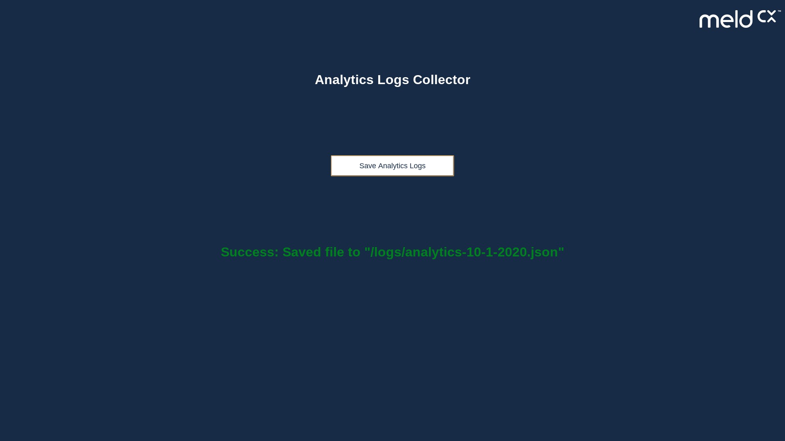

# analytics-collector

## App Installation
Create a packaged app with `index.html`, `index.js`, `logo.png` files in MeldCX dashboard.

## App Usage

1. Plug-in the USB stick into your chrome device.
    
2. Click on "Save Analytics Logs" button and select the folder to save.
    
3. You should see below success message once complete.
    
4. During folder selection, if you have clicked on "cancel" button or not selected folder for long time. You may get below message.
```bash
  Folder isn't selected. Please try again.
```